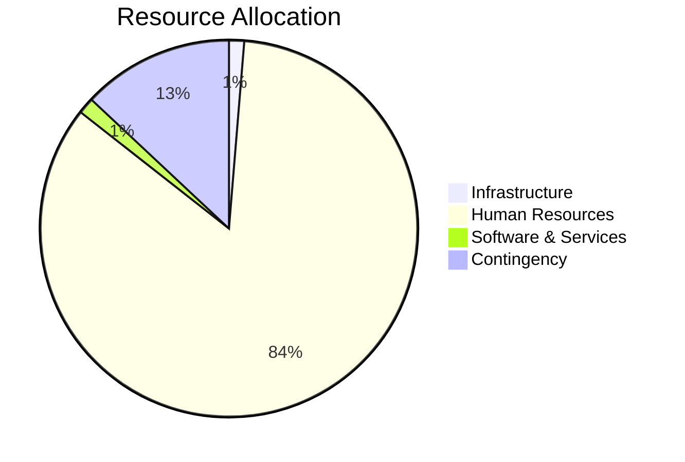
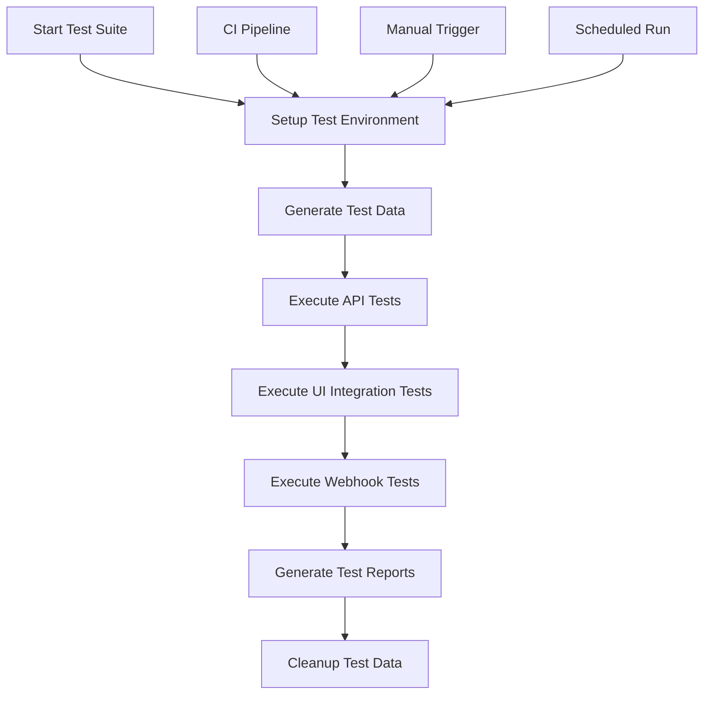

# Cycle 2 Planning: Jodit React Clone Project

## Executive Summary

This document outlines the strategic plans, goals, and implementation strategy for Cycle 2 of the Jodit React Clone project. Building on the modernization achievements of Cycle 1 and the stabilization efforts of the transition phase, Cycle 2 will focus on enhancing integration capabilities, implementing advanced features, and preparing the project for production deployment.

## Vision & Goals

### Vision Statement

To deliver a production-ready integration platform that seamlessly connects Square's inventory system with Spocket, providing reliable synchronization, robust error handling, and an intuitive user experience.

### Primary Goals

1. **Feature Completeness**: Implement all remaining core integration features
2. **Performance Optimization**: Enhance performance for high-volume data synchronization
3. **User Experience**: Develop intuitive UI components for integration management
4. **Production Readiness**: Prepare the system for production deployment
5. **Extensibility**: Ensure the architecture supports future integrations

## Key Focus Areas

### 1. Advanced Integration Features

Building on the foundation established in Cycle 1, Cycle 2 will implement the following advanced integration features:

| Feature | Description | Priority |
|---------|-------------|----------|
| Bulk Synchronization | Support for bulk operations with progress tracking | High |
| Real-time Sync | Implement real-time synchronization via webhooks | High |
| Conflict Resolution UI | User interface for resolving synchronization conflicts | High |
| Scheduled Sync | Configurable scheduled synchronization | Medium |
| Differential Sync | Only synchronize changed data to reduce API usage | Medium |
| Multi-location Support | Support for multiple Square locations | Low |

### 2. Performance Enhancements

Cycle 2 will focus on optimizing performance for production use:

| Enhancement | Description | Priority |
|-------------|-------------|----------|
| Caching Layer | Implement caching to reduce API calls | High |
| Batch Processing | Optimize batch operations for efficiency | High |
| Rate Limiting | Advanced rate limiting with dynamic adjustment | Medium |
| Connection Pooling | Database connection pooling for efficiency | Medium |
| Query Optimization | Optimize database queries for performance | Medium |
| Asset Optimization | Optimize frontend asset delivery | Low |

### 3. User Interface Development

Cycle 2 will develop UI components for integration management:

| Component | Description | Priority |
|-----------|-------------|----------|
| Integration Dashboard | Overview of integration status and metrics | High |
| Sync Configuration UI | UI for configuring synchronization settings | High |
| Conflict Resolution Interface | UI for resolving synchronization conflicts | High |
| Error Management Console | Interface for viewing and resolving errors | Medium |
| Analytics Dashboard | Visualization of synchronization metrics | Medium |
| Settings Management | UI for managing integration settings | Medium |

### 4. Security Enhancements

Security improvements for production readiness:

| Enhancement | Description | Priority |
|-------------|-------------|----------|
| OAuth Flow Security | Enhanced OAuth token management and security | High |
| Data Encryption | Encryption for sensitive data at rest | High |
| Rate Limiting | Protection against brute force attacks | High |
| CORS Configuration | Secure CORS settings for API endpoints | Medium |
| Input Validation | Enhanced validation for all user inputs | Medium |
| Security Headers | Implement security headers for frontend | Medium |

### 5. Monitoring & Reliability

Tools and features for monitoring and ensuring reliability:

| Feature | Description | Priority |
|---------|-------------|----------|
| Error Tracking | Integrate Sentry for error tracking | High |
| Logging System | Enhanced structured logging | High |
| Health Check API | Endpoints for system health monitoring | High |
| Metrics Collection | Key performance and business metrics | Medium |
| Alerting System | Alerts for critical issues | Medium |
| Performance Monitoring | Real-time performance monitoring | Medium |

## Technical Architecture Enhancements

### 1. Database Architecture

Cycle 2 will implement a robust database architecture:

```
┌───────────────────┐     ┌───────────────────┐     ┌───────────────────┐
│                   │     │                   │     │                   │
│  Entity Mapping   │     │  Sync History     │     │  Error Tracking   │
│  ─────────────    │     │  ─────────────    │     │  ─────────────    │
│  - ID             │     │  - ID             │     │  - ID             │
│  - SourceID       │◄────┤  - TaskID         │◄────┤  - TaskID         │
│  - TargetID       │     │  - EntityType     │     │  - Code           │
│  - EntityType     │     │  - Direction      │     │  - Message        │
│  - LastSynced     │     │  - Status         │     │  - Timestamp      │
│                   │     │  - Timestamp      │     │  - Retries        │
└───────────────────┘     └───────────────────┘     └───────────────────┘
        ▲                         ▲                         ▲
        │                         │                         │
        └─────────────────┬───────┴─────────────────┬───────┘
                          │                         │
                    ┌─────┴─────┐           ┌───────┴───────┐
                    │           │           │               │
                    │  Users    │           │ Configuration  │
                    │           │           │               │
                    └───────────┘           └───────────────┘
```

### 2. Integration Architecture

Enhanced integration architecture for Cycle 2:

```
                   ┌───────────────────────────────────┐
                   │                                   │
                   │         Integration Layer         │
                   │                                   │
                   └─────────────────┬─────────────────┘
                                     │
                                     ▼
┌───────────────────┐     ┌───────────────────┐     ┌───────────────────┐
│                   │     │                   │     │                   │
│   Square Adapter  │     │   Sync Engine     │     │  Spocket Adapter  │
│   ─────────────   │◄───►│   ─────────────   │◄───►│  ─────────────    │
│   - API Client    │     │   - Orchestrator  │     │  - API Client     │
│   - Data Mappers  │     │   - Scheduler     │     │  - Data Mappers   │
│   - Webhooks      │     │   - Error Handler │     │  - Webhooks       │
│                   │     │   - Rate Limiter  │     │                   │
└───────────────────┘     └───────────────────┘     └───────────────────┘
                                     │
                                     ▼
                   ┌───────────────────────────────────┐
                   │                                   │
                   │          Persistence Layer        │
                   │                                   │
                   └───────────────────────────────────┘
```

### 3. React Component Architecture

React component architecture for UI development:

```
┌───────────────────────────────────────────────────────────┐
│                        App                                │
└───────────────┬───────────────────────────────┬───────────┘
                │                               │
    ┌───────────▼───────────┐       ┌───────────▼───────────┐
    │    Integration        │       │      Editor           │
    │    Dashboard          │       │      Component        │
    └───────────┬───────────┘       └───────────┬───────────┘
                │                               │
┌───────────────┴───────────┐       ┌───────────▼───────────┐
│                           │       │                       │
│  ┌─────────────────────┐  │       │  ┌─────────────────┐  │
│  │  Sync Status        │  │       │  │  Toolbar        │  │
│  └─────────────────────┘  │       │  └─────────────────┘  │
│                           │       │                       │
│  ┌─────────────────────┐  │       │  ┌─────────────────┐  │
│  │  Error Console      │  │       │  │  Content Area   │  │
│  └─────────────────────┘  │       │  └─────────────────┘  │
│                           │       │                       │
│  ┌─────────────────────┐  │       │  ┌─────────────────┐  │
│  │  Configuration      │  │       │  │  Plugins        │  │
│  └─────────────────────┘  │       │  └─────────────────┘  │
│                           │       │                       │
└───────────────────────────┘       └───────────────────────┘
```

## Implementation Strategy

### 1. Team Structure & Roles

| Team | Responsibilities | Key Members |
|------|-----------------|-------------|
| Backend Integration | API integration, sync engine, database | Backend Lead + 2 Developers |
| Frontend | UI components, React integration | Frontend Lead + 2 Developers |
| QA | Testing, quality assurance | QA Lead + 1 Tester |
| DevOps | CI/CD, deployment, infrastructure | DevOps Engineer |
| Product | Requirements, user stories, prioritization | Product Manager |

### 2. Development Approach

Cycle 2 will use an agile development approach with:

- Two-week sprints
- Daily stand-ups
- Sprint planning, review, and retrospective
- Continuous integration and deployment
- Feature branches with pull request workflow
- Peer review for all code changes

### 3. Feature Prioritization Framework

Features will be prioritized using the following framework:

| Criteria | Weight | Description |
|----------|--------|-------------|
| Business Value | 40% | Impact on business objectives |
| Technical Risk | 25% | Risk of implementation |
| Dependencies | 20% | Dependencies on other features |
| Effort | 15% | Implementation effort required |

### 4. Release Strategy

Cycle 2 will use a phased release strategy:

| Phase | Focus | Timeframe |
|-------|-------|-----------|
| Alpha | Core functionality, internal testing | Weeks 1-4 |
| Beta | Full feature set, selected users | Weeks 5-8 |
| Release Candidate | Stabilization, performance tuning | Weeks 9-10 |
| Production | Full production release | Week 12 |

### 5. Testing Strategy

Comprehensive testing strategy for Cycle 2:

| Test Type | Description | Tools |
|-----------|-------------|-------|
| Unit Tests | Test individual components and functions | Jest |
| Integration Tests | Test interactions between components | React Testing Library |
| E2E Tests | Test complete workflows | Cypress |
| API Tests | Test API endpoints | Postman, Jest |
| Performance Tests | Test system performance | Lighthouse, JMeter |
| Security Tests | Test for security vulnerabilities | OWASP ZAP, npm audit |

## Feature Breakdown & Timeline

### Sprint 1-2: Foundation Enhancement

| Feature | Description | Owner | Status |
|---------|-------------|-------|--------|
| Database Implementation | Implement database schema and migrations | Backend | To Do |
| Authentication Enhancement | Improve OAuth flow and security | Backend | To Do |
| Component Structure | Set up React component architecture | Frontend | To Do |
| CI/CD Pipeline | Complete CI/CD pipeline setup | DevOps | To Do |

### Sprint 3-4: Core Integration Features

| Feature | Description | Owner | Status |
|---------|-------------|-------|--------|
| Webhook Implementation | Complete webhook handlers and validation | Backend | To Do |
| Sync Engine | Enhance synchronization engine | Backend | To Do |
| Dashboard UI | Basic integration dashboard UI | Frontend | To Do |
| Error Handling | Improve error handling and recovery | Backend | To Do |

### Sprint 5-6: Advanced Features

| Feature | Description | Owner | Status |
|---------|-------------|-------|--------|
| Conflict Resolution | Implement conflict resolution system | Backend | To Do |
| Conflict UI | User interface for conflict resolution | Frontend | To Do |
| Bulk Operations | Support for bulk synchronization | Backend | To Do |
| Scheduled Sync | Configurable scheduled synchronization | Backend | To Do |

### Sprint 7-8: User Experience

| Feature | Description | Owner | Status |
|---------|-------------|-------|--------|
| Analytics Dashboard | Visualization of sync metrics | Frontend | To Do |
| Settings UI | Interface for managing settings | Frontend | To Do |
| Notifications | User notifications for sync events | Frontend | To Do |
| Documentation | User and API documentation | Tech Writer | To Do |

### Sprint 9-10: Performance & Reliability

| Feature | Description | Owner | Status |
|---------|-------------|-------|--------|
| Caching | Implement caching layer | Backend | To Do |
| Performance Optimization | Optimize critical paths | Full Team | To Do |
| Monitoring | Implement monitoring and alerting | DevOps | To Do |
| Load Testing | Comprehensive load testing | QA | To Do |

### Sprint 11-12: Production Readiness

| Feature | Description | Owner | Status |
|---------|-------------|-------|--------|
| Security Audit | Complete security audit | Security | To Do |
| Performance Tuning | Final performance tuning | Full Team | To Do |
| Deployment Automation | Automated deployment pipeline | DevOps | To Do |
| User Acceptance Testing | Final UAT with stakeholders | QA | To Do |

## Technical Debt Management

Technical debt items identified for management in Cycle 2:

| Item | Description | Priority | Owner |
|------|-------------|----------|-------|
| Type Definitions | Improve type definitions for API responses | Medium | Frontend |
| Error Handling | Standardize error handling across services | High | Backend |
| Test Coverage | Increase test coverage in service layer | High | QA |
| Code Documentation | Improve inline code documentation | Medium | All |
| Configuration | Refactor configuration management | Low | DevOps |

## Risk Management

Identified risks for Cycle 2 and mitigation strategies:

| Risk | Impact | Probability | Mitigation |
|------|--------|------------|------------|
| API Changes | High | Medium | API version pinning, monitoring, adapter pattern |
| Performance Issues | High | Medium | Early performance testing, optimization sprints |
| Security Vulnerabilities | Critical | Low | Security reviews, OWASP testing, dependency auditing |
| Scope Creep | High | High | Strict prioritization, change control process |
| Integration Complexity | High | Medium | POCs for complex features, incremental approach |

## Success Criteria

Cycle 2 will be considered successful when:

1. All high-priority features are implemented and tested
2. The system meets performance benchmarks:
   - Synchronization of 1000+ products in under 5 minutes
   - API response time under 500ms for 95% of requests
   - 99.9% uptime for integration services
3. Security audit passes with no critical or high issues
4. Test coverage exceeds 85% across the codebase
5. User acceptance testing is completed successfully

## Resource Requirements

### Infrastructure Resources

| Resource | Specification | Purpose | Estimated Cost |
|----------|--------------|---------|----------------|
| Production Servers | 4 EC2 t3.large instances | Application hosting | $520/month |
| Staging Environment | 2 EC2 t3.medium instances | Testing and validation | $150/month |
| Database | RDS PostgreSQL db.t3.large | Data storage | $180/month |
| Caching Layer | ElastiCache (2 nodes) | Performance optimization | $120/month |
| Object Storage | S3 (500 GB) | Media and backup storage | $15/month |
| CDN | CloudFront | Static asset delivery | $80/month |
| CI/CD Pipeline | GitHub Actions | Automated deployment | $40/month |
| Monitoring | CloudWatch + Datadog | System monitoring | $100/month |

### Human Resources

| Role | Allocation | Duration | Responsibilities |
|------|-----------|----------|------------------|
| Backend Developers | 3 FTE | 12 weeks | API integration, sync engine, database |
| Frontend Developers | 3 FTE | 12 weeks | UI components, React integration |
| QA Engineers | 2 FTE | 12 weeks | Testing, quality assurance |
| DevOps Engineer | 1 FTE | 12 weeks | CI/CD, deployment, infrastructure |
| Product Manager | 0.5 FTE | 12 weeks | Requirements, prioritization |
| Technical Writer | 0.25 FTE | 12 weeks | Documentation |
| UX Designer | 0.5 FTE | 8 weeks | UI/UX design |
| Security Specialist | 0.25 FTE | 4 weeks | Security audit and implementation |

### Development Environment Requirements

| Resource | Specification | Purpose |
|----------|--------------|---------|
| Local Development | Node.js 18+, npm 9+, Docker | Development environment |
| IDE | VS Code with extensions | Code editing |
| Local Database | PostgreSQL 14+ | Local data storage |
| API Testing | Postman, Insomnia | API development and testing |
| Mocking Tools | MSW (Mock Service Worker) | API mocking for frontend |
| Version Control | Git, GitHub | Code management |
| Communication | Slack, Zoom | Team communication |
| Project Management | Jira | Task tracking |

### External Services & Dependencies

| Service | Purpose | Licensing/Cost |
|---------|---------|----------------|
| Square API | Integration with Square | Production API key ($250/month) |
| Spocket API | Integration with Spocket | Enterprise tier ($500/month) |
| Sentry | Error tracking | Team plan ($29/month per developer) |
| LogRocket | Session replay | Business plan ($150/month) |
| Auth0 | Authentication | Developer plan ($23/month per developer) |
| SendGrid | Email notifications | Pro plan ($89/month) |

### Total Resource Budget

| Category | Monthly Cost | Total for Cycle 2 (3 months) |
|----------|-------------|----------------------------|
| Infrastructure | $1,205 | $3,615 |
| Human Resources | $78,000 | $234,000 |
| Software & Services | $1,250 | $3,750 |
| Contingency (15%) | $12,068 | $36,204 |
| **Total** | **$92,523** | **$277,569** |



## Integration Test Scenarios

### Product Synchronization Test Cases

| Test ID | Scenario | Steps | Expected Result | Automation |
|--------|----------|-------|-----------------|-----------|
| PS-001 | Basic product sync | 1. Create product in Square<br>2. Trigger sync<br>3. Verify in Spocket | Product appears in Spocket with correct attributes | Automated |
| PS-002 | Product update sync | 1. Update product in Square<br>2. Trigger sync<br>3. Verify in Spocket | Updates reflected in Spocket | Automated |
| PS-003 | Product deletion | 1. Delete product in Square<br>2. Trigger sync<br>3. Check Spocket | Product marked inactive in Spocket | Automated |
| PS-004 | Bulk product sync | 1. Create 100+ products in Square<br>2. Trigger bulk sync<br>3. Monitor progress<br>4. Verify in Spocket | All products synced with correct progress tracking | Automated |
| PS-005 | Product with variants | 1. Create product with variants in Square<br>2. Trigger sync<br>3. Verify in Spocket | Product with all variants correctly synced | Automated |

### Inventory Synchronization Test Cases

| Test ID | Scenario | Steps | Expected Result | Automation |
|--------|----------|-------|-----------------|-----------|
| IS-001 | Inventory update | 1. Update inventory in Square<br>2. Trigger sync<br>3. Verify in Spocket | Inventory levels updated in Spocket | Automated |
| IS-002 | Zero inventory | 1. Set inventory to 0 in Square<br>2. Trigger sync<br>3. Verify in Spocket | Product shown as out of stock in Spocket | Automated |
| IS-003 | Bulk inventory update | 1. Update inventory for 50+ products<br>2. Trigger sync<br>3. Verify in Spocket | All inventory levels correctly updated | Automated |
| IS-004 | Location-specific inventory | 1. Set different inventory levels per location<br>2. Trigger sync<br>3. Verify in Spocket | Location-specific inventory correctly reflected | Manual |
| IS-005 | Inventory threshold alerts | 1. Set inventory below threshold<br>2. Trigger sync<br>3. Check for alerts | Low inventory alerts generated | Automated |

### Order Synchronization Test Cases

| Test ID | Scenario | Steps | Expected Result | Automation |
|--------|----------|-------|-----------------|-----------|
| OS-001 | Basic order creation | 1. Create order in Spocket<br>2. Trigger sync<br>3. Verify in Square | Order created in Square with correct items and customer | Automated |
| OS-002 | Order fulfillment | 1. Create order in Spocket<br>2. Fulfill in Square<br>3. Trigger sync<br>4. Check Spocket | Order marked as fulfilled in Spocket | Automated |
| OS-003 | Order cancellation | 1. Create order in Spocket<br>2. Cancel in Square<br>3. Trigger sync<br>4. Check Spocket | Order marked as cancelled in Spocket | Automated |
| OS-004 | Partial fulfillment | 1. Create multi-item order<br>2. Partially fulfill in Square<br>3. Trigger sync<br>4. Check Spocket | Order shows partial fulfillment status | Manual |
| OS-005 | Order with discounts | 1. Create order with discounts<br>2. Trigger sync<br>3. Verify in Square | Discounts correctly applied in Square | Manual |

### Authentication & Authorization Test Cases

| Test ID | Scenario | Steps | Expected Result | Automation |
|--------|----------|-------|-----------------|-----------|
| AA-001 | OAuth authorization | 1. Initiate OAuth flow<br>2. Authorize application<br>3. Verify token storage | Tokens correctly obtained and stored | Semi-automated |
| AA-002 | Token refresh | 1. Wait for token expiration<br>2. Perform API operation<br>3. Verify token refresh | Token automatically refreshed | Automated |
| AA-003 | Invalid token handling | 1. Invalidate token<br>2. Attempt API operation<br>3. Observe behavior | System requests new authorization | Automated |
| AA-004 | Permission scopes | 1. Authorize with limited scopes<br>2. Attempt operations requiring different scopes | Operations correctly limited by scope | Manual |
| AA-005 | Multi-user authorization | 1. Connect multiple user accounts<br>2. Perform operations for each account | Operations isolated to correct accounts | Manual |

### Webhook Integration Test Cases

| Test ID | Scenario | Steps | Expected Result | Automation |
|--------|----------|-------|-----------------|-----------|
| WH-001 | Product created webhook | 1. Configure webhook<br>2. Create product in Square<br>3. Observe webhook handling | Webhook received and processed | Automated |
| WH-002 | Inventory updated webhook | 1. Configure webhook<br>2. Update inventory in Square<br>3. Observe webhook handling | Webhook triggers inventory sync | Automated |
| WH-003 | Order status webhook | 1. Configure webhook<br>2. Update order status in Square<br>3. Observe webhook handling | Order status updated in Spocket | Automated |
| WH-004 | Webhook retry mechanism | 1. Configure webhook<br>2. Trigger event<br>3. Make endpoint temporarily unavailable<br>4. Restore endpoint | Webhook delivery retried successfully | Manual |
| WH-005 | Webhook validation | 1. Send invalid webhook payload<br>2. Observe system response | Invalid webhook rejected | Automated |

### Test Environments

#### Local Integration Testing Environment

- Docker-based environment with Square and Spocket API mocks
- Local database for persistence
- Mock server for simulating webhook events
- Test data generator for creating test scenarios

#### Staging Integration Testing Environment

- Connected to Square Sandbox environment
- Connected to Spocket testing environment
- Full infrastructure deployment matching production
- Isolated test data to prevent production impact
- Automated test suite execution

### Test Data Requirements

| Data Category | Volume | Generation Method | Notes |
|---------------|--------|-------------------|-------|
| Products | 500+ varied products | Automated generation + Square API | Include various product types and attributes |
| Inventory | Variable levels for all products | Automated scripts | Include edge cases (zero, high volume) |
| Orders | 100+ orders in various states | Test scripts | Include all order statuses and edge cases |
| Users | 10+ test accounts | Manual creation | Different permission levels |
| Payments | Test payment methods | Square test cards | Cover all payment scenarios |

### Integration Test Automation Strategy

- **Automation Framework**: Jest for unit tests, Cypress for E2E integration tests
- **CI Integration**: All tests run on pull requests and nightly on staging
- **Test Data**: Combination of fixed test fixtures and dynamically generated data
- **Mocking Strategy**: MSW for API mocking, dedicated test doubles for external services
- **Coverage Goals**: 90% coverage of integration paths with automated tests



## Conclusion

Cycle 2 represents a critical phase in the Jodit React Clone project, transforming it from a modernized foundation into a production-ready integration platform. By implementing the features, enhancements, and optimizations outlined in this document, the project will deliver a robust solution for Square-Spocket integration that addresses real business needs while maintaining high standards for performance, security, and reliability.

The implementation strategy provides a clear roadmap for development, with a phased approach that balances feature delivery with quality assurance. The team structure, release strategy, and risk management plan are designed to ensure successful execution of the Cycle 2 plan.

---

**Document Information**
- Created: 2025-05-15
- Author: Project Planning Team
- Version: 1.0

