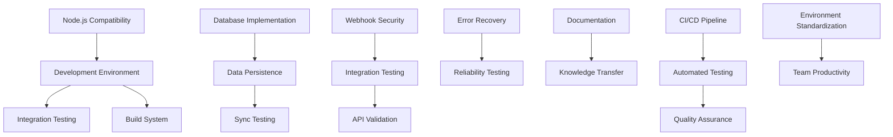

# Transition Phase: Between Cycles 1 and 2

## Overview

This document outlines the transition activities, requirements, and tooling between Cycle 1 and Cycle 2 of the Jodit React Clone project. The transition phase focuses on unifying the context, validating Cycle 1 implementations, and addressing known limitations before embarking on new feature development in Cycle 2.

## Objectives

The primary objectives of the transition phase are:

1. **Context Unification**: Ensure consistent understanding of project context across technical and business domains
2. **Validation**: Complete testing and validation of all Cycle 1 implementations
3. **Issue Resolution**: Address known limitations and issues from Cycle 1
4. **Environment Standardization**: Standardize development environments and tooling
5. **Documentation Completion**: Finalize all required documentation to support Cycle 2

## 1. Context Unification Activities

### 1.1 Technical Context Alignment

| Activity | Description | Responsible | Timeframe |
|----------|-------------|-------------|-----------|
| Architecture Review | Review integration architecture with all team members | Architecture Team | Week 1 |
| API Integration Workshop | Workshop on Square and Spocket API integration points | API Integration Lead | Week 1 |
| Component Walkthrough | Detailed walkthrough of modernized components | Frontend Lead | Week 1 |
| Testing Strategy Review | Review and align on testing approach | QA Lead | Week 1 |

### 1.2 Business Context Alignment

| Activity | Description | Responsible | Timeframe |
|----------|-------------|-------------|-----------|
| Product Vision Session | Session to clarify product vision and goals | Product Owner | Week 1 |
| Integration Requirements Review | Review detailed integration requirements | Business Analyst | Week 1 |
| Success Criteria Workshop | Define success criteria for Cycle 2 | Product + Dev Leads | Week 1 |
| Stakeholder Alignment | Ensure all stakeholders have a consistent understanding | Project Manager | Week 1-2 |

## 2. Validation Activities

### 2.1 Testing Validation

| Activity | Description | Responsible | Tool Support |
|----------|-------------|-------------|-------------|
| Unit Test Coverage Analysis | Analyze and improve test coverage | Developers | Jest Coverage + `./scripts/analyze-coverage.sh` |
| Integration Test Execution | Execute all integration tests | QA Team | `./scripts/test-integration.sh` |
| API Contract Validation | Validate API contracts against specifications | API Team | Postman + OpenAPI validator |
| Browser Compatibility Testing | Test in target browsers | QA Team | BrowserStack + `./scripts/browser-test.sh` |

### 2.2 Performance Validation

| Activity | Description | Responsible | Tool Support |
|----------|-------------|-------------|-------------|
| Performance Benchmark | Establish performance baselines | Performance Engineer | Lighthouse + `./scripts/run-benchmarks.sh` |
| API Response Time Testing | Test API response times under load | Backend Team | JMeter + `./scripts/api-load-test.sh` |
| Bundle Size Analysis | Analyze and optimize bundle size | Frontend Team | Webpack Bundle Analyzer |

### 2.3 Security Validation

| Activity | Description | Responsible | Tool Support |
|----------|-------------|-------------|-------------|
| Dependency Audit | Audit dependencies for vulnerabilities | Security Team | npm audit + `./scripts/security-audit.sh` |
| OAuth Implementation Review | Review OAuth implementation security | Security Team | Manual review + OWASP checklist |
| Webhook Security Validation | Validate webhook security implementation | Security Team | `./scripts/test-webhook-security.sh` |

## 3. Issue Resolution Plan

### 3.1 Node.js Compatibility

```bash
# Create script to validate and configure correct Node.js version
cat > ./scripts/validate-node.sh << 'EOF'
#!/bin/bash
required_version="18.0.0"
current_version=$(node -v | cut -c2-)

function version_lt() { 
  test "$(echo "$@" | tr " " "\n" | sort -rV | head -n 1)" != "$1"; 
}

if version_lt "$current_version" "$required_version"; then
  echo "Error: Node.js version $current_version is below required version $required_version"
  echo "Please upgrade Node.js or use nvm to switch to a compatible version"
  exit 1
fi

# Check for npm compatibility issues
npm_warnings=$(npm --version 2>&1 | grep -i "does not support" || true)
if [ ! -z "$npm_warnings" ]; then
  echo "Warning: Potential npm compatibility issue detected"
  echo "$npm_warnings"
  echo "Consider running: npm install -g npm@latest"
fi

echo "Node.js version $current_version is compatible"
EOF

chmod +x ./scripts/validate-node.sh
```

### 3.2 Database Persistence Implementation

Create a database abstraction layer to replace mock implementations:

```bash
# Create database setup script
mkdir -p ./src/services/database
touch ./src/services/database/index.ts
touch ./src/services/database/repository.ts
touch ./src/services/database/schemas.ts
touch ./src/services/database/migrations.ts
```

Implementation tasks:
- Create database schema for sync data
- Implement repository pattern for data access
- Add migration system for schema updates
- Update mock implementations to use database

### 3.3 Webhook Validation Implementation

```bash
# Create webhook validation utility
mkdir -p ./src/utils/security
touch ./src/utils/security/webhook-validator.ts
touch ./src/utils/security/crypto.ts
```

Implementation tasks:
- Implement HMAC-SHA256 validation for Spocket webhooks
- Implement signature validation for Square webhooks
- Add tests for webhook validation
- Update mock implementations with real validation

### 3.4 Inventory Synchronization Completion

```bash
# Create inventory sync testing script
cat > ./scripts/test-inventory-sync.sh << 'EOF'
#!/bin/bash
# Test inventory synchronization between Square and Spocket
source ./scripts/common.sh

# Configuration
TEST_PRODUCT_ID=${1:-"test_product_$(date +%s)"}
TEST_QUANTITY=10
SQUARE_LOCATION_ID=${SQUARE_LOCATION_ID:-"your_square_location_id"}

# Run inventory sync test
log_info "Starting inventory sync test with product ID: $TEST_PRODUCT_ID"

# Create test inventory in Square
create_square_inventory "$TEST_PRODUCT_ID" "$TEST_QUANTITY" "$SQUARE_LOCATION_ID"

# Trigger inventory sync
trigger_inventory_sync

# Verify in Spocket
verify_spocket_inventory "$TEST_PRODUCT_ID" "$TEST_QUANTITY"

log_success "Inventory sync test completed"
EOF

chmod +x ./scripts/test-inventory-sync.sh
```

Implementation tasks:
- Complete inventory data model
- Implement bidirectional inventory sync
- Add inventory conflict resolution
- Create inventory adjustment tracking

### 3.5 Error Recovery Enhancement

```bash
# Create error recovery testing tool
mkdir -p ./scripts/recovery-tests
touch ./scripts/recovery-tests/network-failure.sh
touch ./scripts/recovery-tests/api-timeout.sh
touch ./scripts/recovery-tests/validation-error.sh
```

Implementation tasks:
- Implement circuit breaker pattern
- Add retry mechanisms with exponential backoff
- Implement transaction rollback capability
- Add error logging and monitoring

## 4. Environment Standardization

### 4.1 Development Environment Setup

```bash
# Create development environment setup script
cat > ./scripts/setup-dev-env.sh << 'EOF'
#!/bin/bash
# Setup development environment for the project

echo "Setting up development environment..."

# Check system requirements
./scripts/validate-node.sh || exit 1

# Install dependencies
npm install

# Setup pre-commit hooks
npx husky install

# Setup environment variables
if [ ! -f .env ]; then
  cp .env.example .env
  echo "Created .env file from template. Please update with your credentials."
fi

# Build project
npm run build

echo "Development environment setup complete!"
EOF

chmod +x ./scripts/setup-dev-env.sh

# Create .env.example file
cat > .env.example << 'EOF'
# Square API Configuration
SQUARE_ACCESS_TOKEN=your_square_access_token
SQUARE_LOCATION_ID=your_square_location_id
SQUARE_RATE_LIMIT=120

# Spocket API Configuration
SPOCKET_CLIENT_ID=your_spocket_client_id
SPOCKET_CLIENT_SECRET=your_spocket_client_secret
SPOCKET_RATE_LIMIT=60

# Database Configuration
DB_HOST=localhost
DB_PORT=5432
DB_NAME=jodit_react_db
DB_USER=postgres
DB_PASSWORD=password

# Logging Configuration
LOG_LEVEL=info
LOG_FILE=logs/app.log
EOF
```

### 4.2 Docker Development Environment

```bash
# Create Docker configuration
cat > docker-compose.yml << 'EOF'
version: '3.8'

services:
  app:
    build:
      context: .
      dockerfile: Dockerfile
    ports:
      - "3000:3000"
    volumes:
      - .:/app
      - /app/node_modules
    environment:
      - NODE_ENV=development
    depends_on:
      - db

  db:
    image: postgres:13
    ports:
      - "5432:5432"
    environment:
      - POSTGRES_USER=postgres
      - POSTGRES_PASSWORD=password
      - POSTGRES_DB=jodit_react_db
    volumes:
      - pgdata:/var/lib/postgresql/data

volumes:
  pgdata:
EOF

cat > Dockerfile << 'EOF'
FROM node:18-alpine

WORKDIR /app

COPY package*.json ./
RUN npm install

COPY . .

RUN npm run build

EXPOSE 3000

CMD ["npm", "run", "dev"]
EOF
```

### 4.3 CI/CD Pipeline Configuration

```bash
# Create GitHub Actions workflow
mkdir -p .github/workflows

cat > .github/workflows/ci.yml << 'EOF'
name: CI

on:
  push:
    branches: [ master ]
  pull_request:
    branches: [ master ]

jobs:
  test:
    runs-on: ubuntu-latest
    
    strategy:
      matrix:
        node-version: [18.x]
        
    steps:
    - uses: actions/checkout@v3
    - name: Use Node.js ${{ matrix.node-version }}
      uses: actions/setup-node@v3
      with:
        node-version: ${{ matrix.node-version }}
    - run: npm ci
    - run: npm run lint
    - run: npm run test
    - run: npm run build
    
  integration-test:
    runs-on: ubuntu-latest
    needs: test
    if: github.event_name == 'push'
    
    steps:
    - uses: actions/checkout@v3
    - name: Use Node.js 18.x
      uses: actions/setup-node@v3
      with:
        node-version: 18.x
    - run: npm ci
    - run: npm run test:integration
      env:
        SQUARE_ACCESS_TOKEN: ${{ secrets.SQUARE_ACCESS_TOKEN }}
        SQUARE_LOCATION_ID: ${{ secrets.SQUARE_LOCATION_ID }}
        SPOCKET_CLIENT_ID: ${{ secrets.SPOCKET_CLIENT_ID }}
        SPOCKET_CLIENT_SECRET: ${{ secrets.SPOCKET_CLIENT_SECRET }}
EOF
```

## 5. Documentation Completion

### 5.1 Technical Documentation

| Document | Description | Responsible | Status |
|----------|-------------|-------------|--------|
| API Documentation | Complete API endpoint documentation | API Team | To Do |
| Architecture Overview | System architecture documentation | Architecture Team | To Do |
| Integration Guide | Guide for integrating with Square and Spocket | Integration Team | To Do |
| Database Schema | Database schema documentation | Backend Team | To Do |

### 5.2 Process Documentation

| Document | Description | Responsible | Status |
|----------|-------------|-------------|--------|
| Development Workflow | Document development process | Dev Lead | To Do |
| Release Process | Document release and deployment process | DevOps | To Do |
| Testing Strategy | Comprehensive testing strategy documentation | QA Lead | To Do |
| Error Handling Guide | Guide for error handling across the system | Backend Lead | To Do |

### 5.3 User Documentation

| Document | Description | Responsible | Status |
|----------|-------------|-------------|--------|
| Component Usage Guide | Guide for using the Jodit React component | Frontend Team | To Do |
| Configuration Reference | Reference for all configuration options | Technical Writer | To Do |
| Integration Examples | Example code for common integration scenarios | Developer Advocate | To Do |
| Troubleshooting Guide | Common issues and solutions | Support Team | To Do |

## 6. Tooling Requirements

### 6.1 Development Tools

| Tool | Purpose | Status |
|------|---------|--------|
| VS Code Extensions | Standardized VS Code setup | To Configure |
| ESLint + Prettier | Code quality and formatting | Implemented |
| TypeScript | Type checking | Implemented |
| Husky | Git hooks | Implemented |
| Commitlint | Standardized commit messages | To Implement |

### 6.2 Testing Tools

| Tool | Purpose | Status |
|------|---------|--------|
| Jest | Unit testing | Implemented |
| React Testing Library | Component testing | Implemented |
| Cypress | E2E testing | To Implement |
| Postman | API testing | To Configure |
| Lighthouse | Performance testing | To Configure |

### 6.3 CI/CD Tools

| Tool | Purpose | Status |
|------|---------|--------|
| GitHub Actions | CI/CD pipeline | To Implement |
| Docker | Containerization | To Implement |
| NPM Scripts | Build and deployment | Implemented |
| Code Coverage | Coverage reporting | To Configure |

### 6.4 Monitoring Tools

| Tool | Purpose | Status |
|------|---------|--------|
| Winston | Logging | Implemented |
| Sentry | Error tracking | To Implement |
| Prometheus | Metrics collection | To Implement |
| Grafana | Metrics visualization | To Implement |

## 7. Transition Timeline

| Week | Focus Area | Key Deliverables |
|------|------------|------------------|
| Week 1 | Context Unification | Completed workshops, aligned understanding |
| Week 2 | Validation | Test execution, performance benchmarks |
| Week 3 | Issue Resolution | Node.js compatibility, database implementation |
| Week 4 | Issue Resolution | Webhook validation, inventory sync completion |
| Week 5 | Environment Standardization | Development environment, CI/CD pipeline |
| Week 6 | Documentation & Finalization | Completed documentation, transition report |

## 8. Success Criteria for Transition Completion

1. All validation tests pass with >90% code coverage
2. All identified Cycle 1 issues are resolved
3. Development environments are standardized and documented
4. CI/CD pipeline is operational
5. Documentation is complete and up-to-date
6. Technical debt is cataloged and prioritized for Cycle 2

## 9. Risk Assessment and Mitigation

| Risk | Impact | Probability | Mitigation |
|------|--------|------------|------------|
| Node.js compatibility issues | High | Medium | Establish clear version requirements, use nvm |
| Integration testing environment unavailability | High | Low | Create sandbox environments with mocks |
| Square or Spocket API changes | Medium | Medium | Implement API version pinning, monitor changes |
| Knowledge siloing | Medium | Medium | Cross-training sessions, pair programming |
| Scope creep in transition phase | High | High | Strict prioritization, clearly defined exit criteria |

## Conclusion

The transition phase between Cycles 1 and 2 is critical for ensuring a stable foundation for future development. By completing the activities outlined in this document, the project will have addressed key limitations from Cycle 1, unified understanding across the team, and standardized development practices for efficient execution in Cycle 2.

## 10. Dependency Mapping and Validation Workflow

### 10.1 Component Dependencies

The following diagram illustrates the dependencies between various components and activities during the transition phase:



### 10.2 Task Dependencies

Critical path dependencies for transition phase completion:

```mermaid
gantt
    title Transition Phase Timeline
    dateFormat  YYYY-MM-DD
    
    section Context Unification
    Architecture Review        :a1, 2025-05-20, 3d
    API Integration Workshop   :a2, after a1, 2d
    Component Walkthrough      :a3, after a2, 1d
    
    section Validation
    Unit Test Completion       :b1, after a3, 5d
    Integration Test Execution :b2, after b1, 3d
    Performance Benchmarking   :b3, after b2, 2d
    
    section Issue Resolution
    Node.js Compatibility      :c1, after a3, 2d
    Database Implementation    :c2, after c1, 7d
    Webhook Security           :c3, after c2, 4d
    Error Recovery             :c4, after c3, 5d
    
    section Environment
    Dev Environment Setup      :d1, after b3, 3d
    Docker Configuration       :d2, after d1, 2d
    CI/CD Pipeline             :d3, after d2, 4d
    
    section Documentation
    Technical Documentation    :e1, after c4, 5d
    Process Documentation      :e2, after e1, 3d
    Final Review               :e3, after d3, after e2, 2d
```

### 10.3 Validation Dependencies Matrix

The following matrix shows the dependencies between validation activities:

| Validation Activity | Prerequisites | Blockers for | Priority |
|---------------------|---------------|--------------|----------|
| Node.js Compatibility | None | Build System, Testing | Critical |
| Database Implementation | Environment Setup | Data Persistence Tests | High |
| Webhook Security | API Access | Integration Tests | High |
| Unit Test Completion | Code Fixes | Test Coverage Reports | Medium |
| Integration Tests | Unit Tests, Environment | Performance Tests | Medium |
| Performance Benchmarks | Integration Tests | Optimization | Low |
| Security Audit | All Implementation | Final Approval | Critical |

### 10.4 Validation Workflow

The validation workflow follows this process:

1. **Environment Preparation**
   - Validate Node.js compatibility
   - Set up development environment
   - Configure testing tools

2. **Component Validation**
   - Unit testing (isolated components)
   - Integration testing (component interactions)
   - End-to-end testing (complete workflows)

3. **Performance Validation**
   - Benchmark critical operations
   - Validate against performance targets
   - Identify optimization opportunities

4. **Security Validation**
   - Dependency audit
   - Authentication and authorization review
   - Webhook security validation

5. **Documentation Validation**
   - Technical review
   - User documentation review
   - Process documentation review

### 10.5 Rollback Procedures

In case validation fails, the following rollback procedures are in place:

```bash
# Create rollback script for database changes
cat > ./scripts/rollback-db.sh << 'EOF'
#!/bin/bash
# Rollback database changes to a specific version

DB_VERSION=${1:-"previous"}
echo "Rolling back database to version: $DB_VERSION"

if [ "$DB_VERSION" = "previous" ]; then
  npx knex migrate:down
else
  npx knex migrate:down --to=$DB_VERSION
fi

echo "Database rollback complete"
EOF

chmod +x ./scripts/rollback-db.sh

# Create code version rollback script
cat > ./scripts/rollback-code.sh << 'EOF'
#!/bin/bash
# Rollback code to a specific commit or tag

TARGET=${1:-"HEAD~1"}
BRANCH=${2:-"$(git branch --show-current)"}

echo "Rolling back code to: $TARGET on branch $BRANCH"

git checkout $BRANCH
git reset --hard $TARGET

echo "Code rollback complete"
EOF

chmod +x ./scripts/rollback-code.sh
```

### 10.6 Sign-off Checklist

Before completing the transition phase, all stakeholders must sign off on the following checklist:

- [ ] All unit tests pass with >90% coverage
- [ ] All integration tests pass successfully
- [ ] Performance benchmarks meet or exceed targets
- [ ] Security audit passes with no critical issues
- [ ] Documentation is complete and reviewed
- [ ] CI/CD pipeline is operational
- [ ] Development environment is standardized
- [ ] All identified Cycle 1 issues are resolved
- [ ] Technical debt is documented and prioritized

---

**Document Information**
- Created: 2025-05-15
- Author: Transition Planning Team
- Version: 1.1

